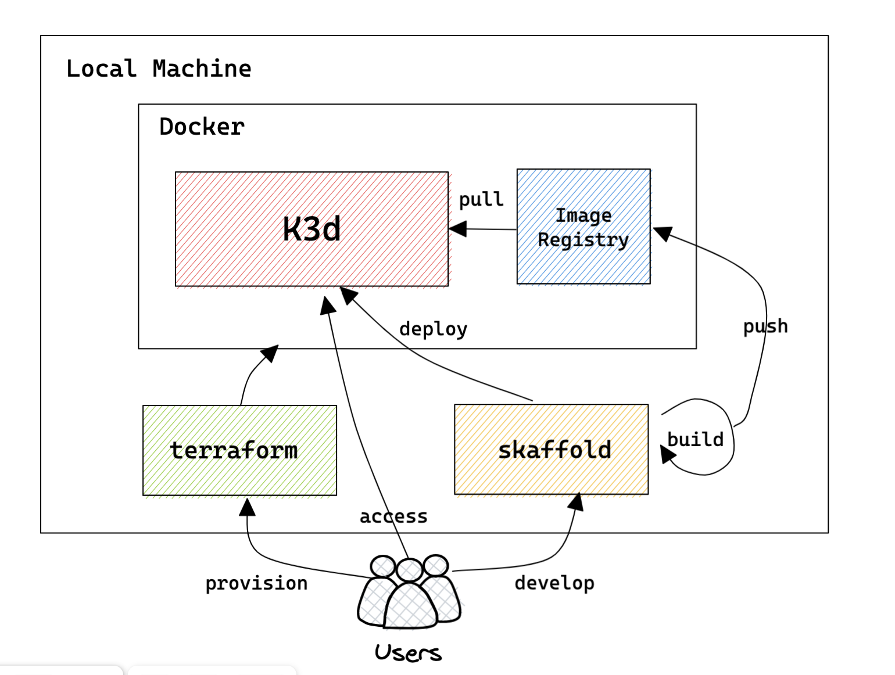

# k3d-devenv

## What is k3d-devenv

K8s local development environment using K3d and skaffold



## Prerequisite
- Docker
- Terraform
- K3d
- Skaffold (v2.0.0)


## OS
- MacOSX (intel, silicon)
- Linux Ubuntu

## How to start

### Provision K3d using terraform
Add local docker registry name to host file `/etc/hosts` to push images.
otherwise skaffold can't push images.
```bash
#/etc/hosts
127.0.0.1 k3d-registry.localhost
```
Run terraform
```bash
$>terraform plan
$>terraform apply --auto-approve

k3d_cluster.cluster: Creating...
k3d_cluster.cluster: Still creating... [10s elapsed]
k3d_cluster.cluster: Still creating... [20s elapsed]
k3d_cluster.cluster: Still creating... [30s elapsed]
k3d_cluster.cluster: Still creating... [40s elapsed]
k3d_cluster.cluster: Provisioning with 'local-exec'...
k3d_cluster.cluster (local-exec): (output suppressed due to sensitive value in config)
k3d_cluster.cluster: Creation complete after 46s [id=mycluster]

Apply complete! Resources: 1 added, 0 changed, 0 destroyed.

Outputs:

local_k8s_config = <sensitive>
```
> **Warning**
> please try run several times if unsuccessful.
  
Check terraform state
```bash
$>terraform state list
```
Get k3d config file
```
terraform output -raw local_k8s_config
```

### Setting kubeconfig for deployment
k3d config file was created as `local-k8s-config` as default.
if file does not exist, create a file using terraform output command
```bash
terraform output -raw local_k8s_config > local-k8s-config 
```

Set k8s environment with local-k8s-config
```
export KUBECONFIG=$(pwd)/local-k8s-config
```


### Run Skaffold
This repo has two skaffold examples (see reference)
- skaffold/getting-started
- skaffold/getting-started-kustomize


Set true to local.push in build spec of skaffold config to push image whenever it builds.
  ```
  apiversion: skaffold/v3
  kind: config
  build:
    local:
      push: true
  ```

Run skaffold with `--default-repo` to use k3d image registry
```bash
skaffold dev --default-repo=k3d-registry.localhost:12345

latest: digest: sha256:a190da480a174d71ccb2fb0d7fa1e87f22c3b6d0597490d7dfb42adf489a552a size: 739
Build [skaffold-example] succeeded
Tags used in deployment:
 - skaffold-example -> k3d-registry.localhost:12345/skaffold-example:latest@sha256:a190da480a174d71ccb2fb0d7fa1e87f22c3b6d0597490d7dfb42adf489a552a
Starting deploy...
Loading images into k3d cluster nodes...
Images loaded in 41ns
 - pod/getting-started created
Waiting for deployments to stabilize...
 - pods is ready.
Deployments stabilized in 3.137 seconds
Press Ctrl+C to exit
Watching for changes...
[getting-started] Hello world!
[getting-started] Hello world!
[getting-started] Hello world!
[getting-started] Hello world!
```
## Destroy
```bash
terraform destroy --auto-approve

#if you want to delete dagling all images
#docker image prune 
```
## Reference
- [https://github.com/pvotal-tech/terraform-provider-k3d](https://github.com/pvotal-tech/terraform-provider-k3d)
- [https://k3d.io/v5.4.6](https://k3d.io/v5.4.6/)
- [https://skaffold.dev](https://skaffold.dev/)

